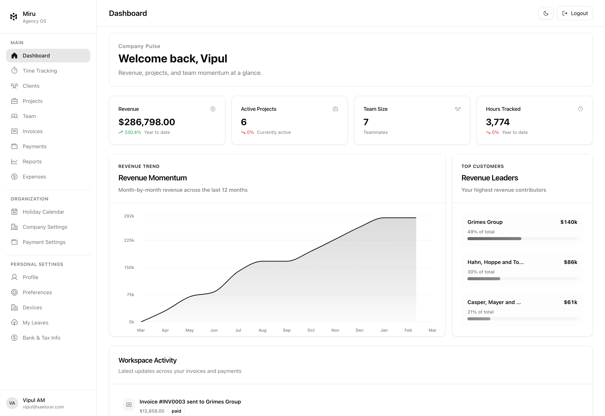
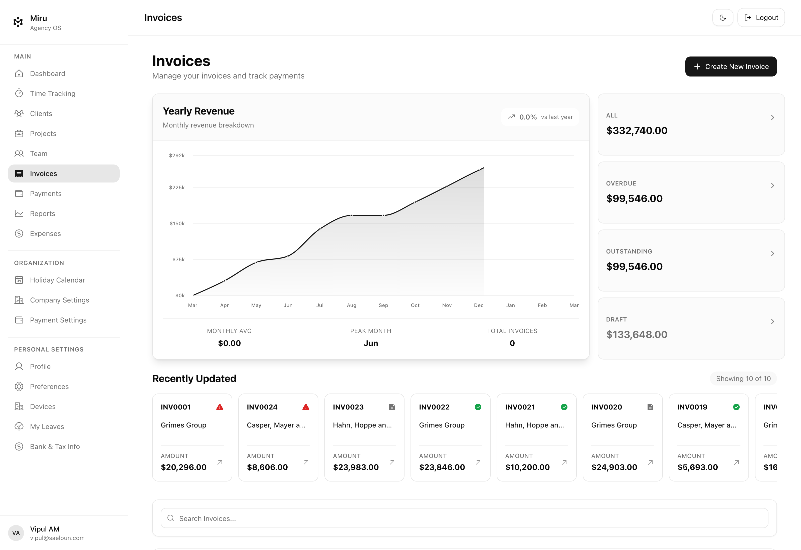
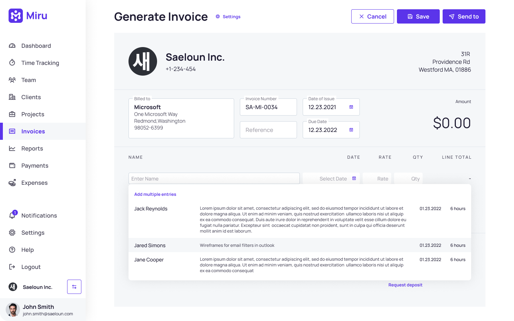
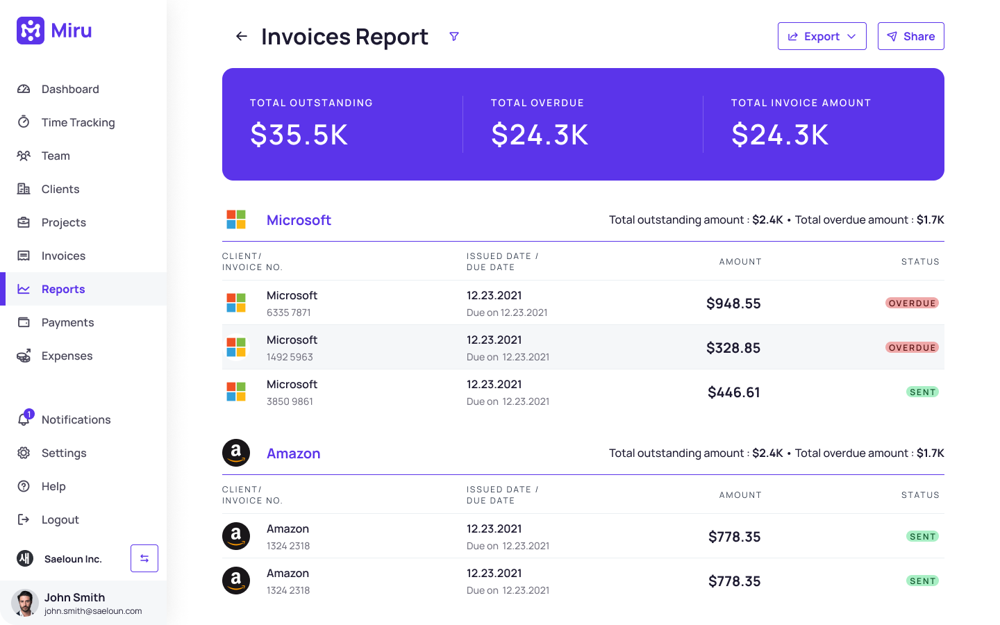

  
   

  Open-source time tracking, invoicing, expenses, payments, and reporting for agencies, consultancies, and service businesses.

  Stop stitching together a timer, spreadsheet, invoicing app, expense tracker, and payment tool.
  Miru brings the full workflow into one product.

  <a href="https://app.miru.so">Start free</a>
  ·
  <a href="https://miru.so">Visit miru.so</a>
  ·
  <a href="https://miru.so/pricing">See pricing</a>
  ·
  <a href="https://docs.miru.so">Read the docs</a>

---

## Track time. Send invoices. Get paid.

Miru is built for teams that bill by the hour and want the full money workflow in one place.

- Track time without friction
- Turn tracked work into invoices
- Log and review expenses
- Collect payments through Stripe
- See revenue, utilization, and aging reports

  <a href="https://app.miru.so">Start tracking free</a>
  ·
  <a href="https://github.com/saeloun/miru-web">View on GitHub</a>

## Product Preview

<table>
  <tr>
    <td width="50%">
      
      
<strong>Dashboard</strong> Revenue, projects, and team momentum in one place.

    </td>
    <td width="50%">
      
      
<strong>Invoices</strong> Track status, amounts, and cash flow from a single view.

    </td>
  </tr>
  <tr>
    <td width="50%">
      
      
<strong>Invoice Builder</strong> Turn billable work into polished invoices without extra tools.

    </td>
    <td width="50%">
      
      
<strong>Reports</strong> See outstanding revenue, overdue amounts, and what needs action.

    </td>
  </tr>
</table>

  <a href="https://app.miru.so">Start free</a>
  ·
  <a href="https://miru.so">See the full product story</a>

## Why Miru

- One workflow from time entry to payment instead of five disconnected tools
- Open source and MIT licensed, so you can self-host and keep control
- Designed for agencies, consultancies, and service teams that care about hours, invoices, expenses, and cash flow
- Free to start, with simple pricing on hosted plans at [miru.so/pricing](https://miru.so/pricing)

## Major Features

- 🕒 **Time Tracking**: Intuitive time tracking tools for effortless monitoring of work hours.

- 💼 **Invoicing**: Create professional invoices with ease, using time tracking data. Send invoices directly to clients via email for prompt payment processing.

- 👥 **Team Page**: Collaborative workspace to manage your team's work efficiently.

- 👤 **Client Page**: Centralized client management system for maintaining client information. Easily access client details when creating invoices or reports.

- 🏢 **Client Portal**: Access a client-specific dashboard for a quick overview of all invoices with update status.

- 🚀 **Projects**: Dashboard to add new projects, team members, and rates.

- 📊 **Reports Page**: Generate comprehensive reports for insights into project performance. View time tracking data, expenses, and revenue summaries. Export reports in various formats (PDF, CSV) for sharing or record-keeping.

- 💳 **Integration with Payment Gateways**: Seamlessly connect with STRIPE for quick and secure payments. Accept payments directly through Miru.so to streamline invoicing and payment processing.

## Who It Is For

- Agencies tracking billable time across clients and projects
- Consultancies that need invoices and payments tied directly to work performed
- Service businesses replacing spreadsheets, legacy trackers, and bloated finance tools
- Teams that want hosted software now with the option to self-host later

## Try Miru

- Hosted app: [app.miru.so](https://app.miru.so)
- Product site: [miru.so](https://miru.so)
- Pricing: [miru.so/pricing](https://miru.so/pricing)
- Documentation: [docs.miru.so](https://docs.miru.so)
- Open-source repository: [github.com/saeloun/miru-web](https://github.com/saeloun/miru-web)

## Miru 3.0 Highlights

- Rails 8 + Ruby 4.0.1 upgrade
- Modernized React + TypeScript frontend and UI refresh
- Responsive email layouts with local preview coverage
- Render-first deployment workflow for production and one-click setup
- Playwright-based end-to-end verification and release QA

## Documentation

For detailed information on how to use Miru Web and its various features, please refer to our official documentation:

[Official Documentation](https://docs.miru.so)

For local development on this branch, see CLAUDE.md and docs under `docs/`.

## Localization Automation

Miru supports automated locale maintenance with `i18n-tasks`.

- Install/update tooling: `mise exec -- bundle install`
- Inspect translation config: `mise exec -- bundle exec rake i18n:config`
- Check locale health: `mise exec -- bundle exec rake i18n:health`
- Translate major Indian locales: `mise exec -- bundle exec rake i18n:translate_india`
- Translate world locales: `mise exec -- bundle exec rake i18n:translate_world`
- Run Google first, then optional AI fallback: `mise exec -- bundle exec rake i18n:translate_auto`

Required env vars:

- `GOOGLE_TRANSLATE_API_KEY`
- `I18N_TRANSLATION_BACKEND=google`
- optional AI fallback:
  - `I18N_AI_TRANSLATION_FALLBACK=true`
  - `I18N_AI_TRANSLATION_BACKEND=openai`
  - `OPENAI_API_KEY`

## Deploy On Render

Miru now ships with a Render Blueprint for one-click infrastructure setup.

- Production branch: `production`
- Release prep branch: `stable-3-0`
- Deploy guide: [docs/docs/contributing-guide/deployment/render.md](docs/docs/contributing-guide/deployment/render.md)
- Blueprint: [render.yaml](render.yaml)

For a fresh Render workspace, use the button above or open:

`https://render.com/deploy?repo=https://github.com/saeloun/miru-web/tree/production`

The Blueprint provisions:

- a web service
- a worker service
- a Postgres database
- a Render Key Value instance

After the stack is created, set your required app secrets and point your custom domain to the web service.

## Release Ownership

- Release owner for Miru 3.0: `Vipul A M`
- Product and OSS stewardship: `Saeloun`

## Star History

## Community Support

- Feel free to join our [Discord](https://discord.gg/UABXyQQ82c) channel for
  support and questions.
- Subscribe to our latest [blog articles](https://blog.miru.so) and tutorials.
- [Discussions](https://github.com/saeloun/miru-web/discussions): Post your
  questions regarding Miru Web
- [**Twitter**](https://x.com/getmiru)

## Contributing

We encourage everyone to contribute to Miru Web! Check out
[Contributing Guide](CONTRIBUTING.md) for guidelines about how to proceed.  

Note: We are working on improving the documentation. So we created a
docusaurus app for documentation. Check out the
[Miru Docs](https://github.com/saeloun/miru-web/tree/production/docs).

## Contributors ✨

Thanks goes to all our contributors

## License

_Miru_ © Saeloun - Released under the [MIT License](LICENSE).
